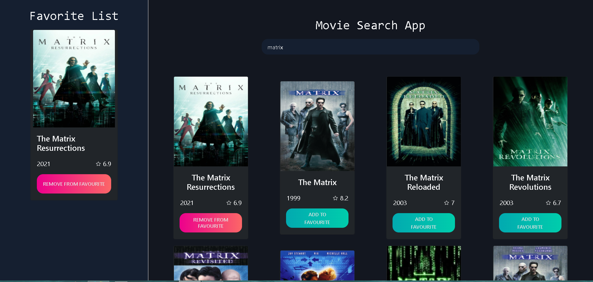

<div id="top"></div>
<!-- ABOUT THE PROJECT -->

## About The Project

You can add the movie you want to your favorite list in this project, where movie information is obtained and displayed on the page via API, and the button changes dynamically depending on whether the movie is in the favorite list. The movies you add to your favorites work in sync with the local storage.




<p align="right">(<a href="#top">back to top</a>)</p>

### Built With

This section should list any major frameworks/libraries used to bootstrap your project. Leave any add-ons/plugins for the acknowledgements section. Here are a few examples.

- [Vue.js](https://vuejs.org/)
- [Bootstrap](https://getbootstrap.com)

<p align="right">(<a href="#top">back to top</a>)</p>

### Prerequisites

- npm
  ```sh
  npm install npm@latest -g
  ```

### Installation

1. Get a free API Key at [TMDB API](https://developers.themoviedb.org/3)
2. Clone the repo
   ```sh
   git clone https://github.com/sunaycansev/de-marke-app.git
   ```
3. Install NPM packages
   ```sh
   npm install
   ```
4. Enter your API in `.env`
   ```shell
   VUE_APP_API_KEY = 'ENTER YOUR API'
   ```
